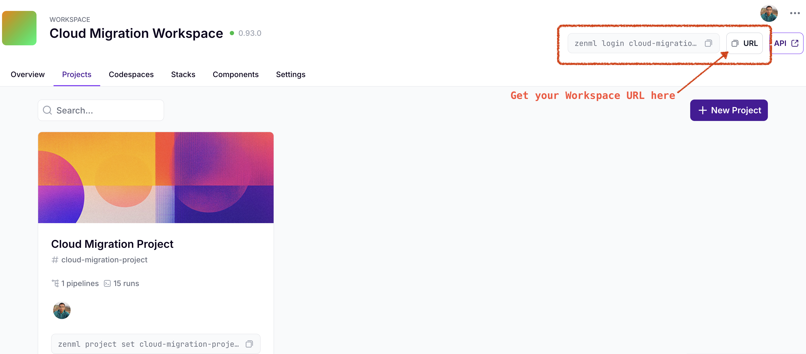
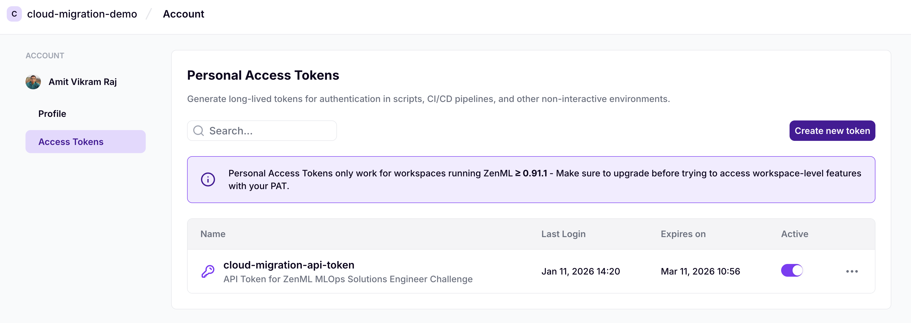
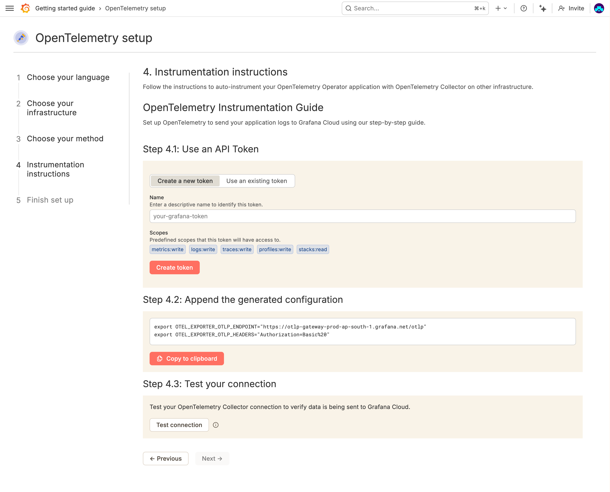
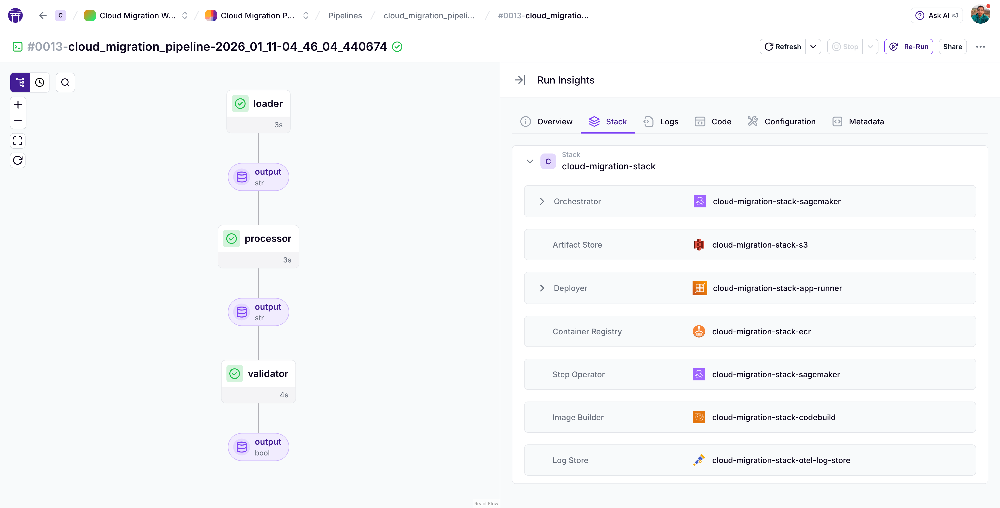
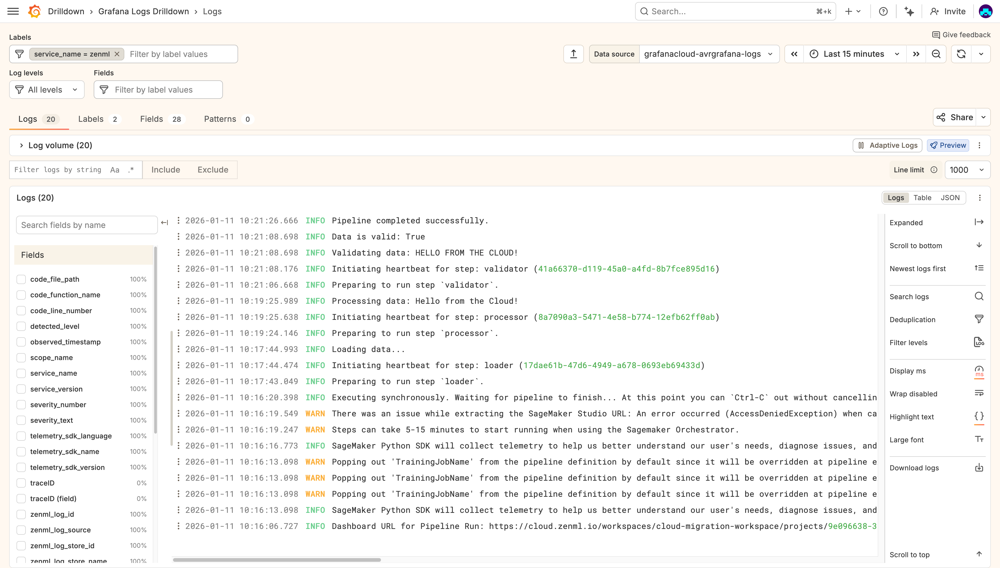
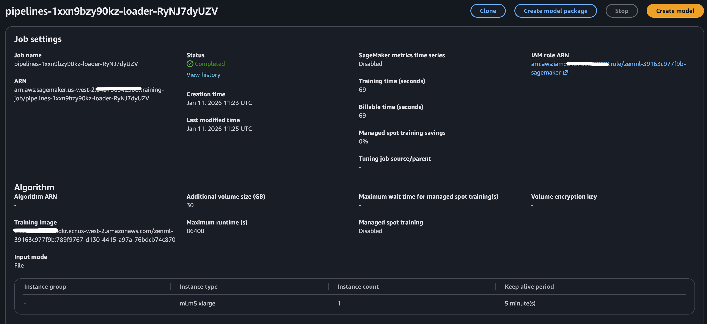
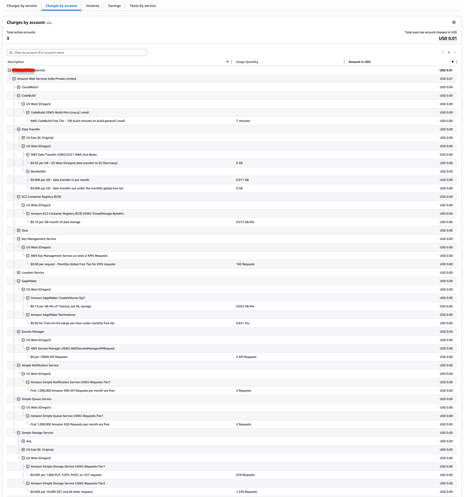

# How to Migrate Your ZenML Pipeline to AWS

For the details of building this solution, please refer to [docs/README.md](./docs/README.md).

## Setup

Assumes you have an AWS account.

1. Install [uv](https://docs.astral.sh/uv/getting-started/installation/) and [Terraform](https://developer.hashicorp.com/terraform/tutorials/aws-get-started/install-cli)

2. Sign up for [ZenML Pro](https://cloud.zenml.io/signup) and create a workspace & project. Get your Workspace URL and API Key
<p align="center">
    
    <br>
    <em>ZenML Workspace URL</em>
    <br>
    
    <br>
    <em>ZenML API Key</em>
</p>

3. Signup for [Grafana Cloud](https://grafana.com/auth/sign-up/create-user), use this [YouTube guide](https://youtu.be/nVdeKPRYmmQ?si=bcuA308dckK-2hUN). Once you login to Grafana Cloud:
    - Go to "Connections" -> "Add a new connection" -> "OpenTelemetry (OTLP)".
    - Copy the OTLP endpoint and the API key.
    <p align="center">
        
        <br>
        <em>Grafana OTel Setup</em>
    </p>


4. Use the provided `.env.example` file to create a `.env` file in the root directory. Populate it with your credentials:
    ```shell
    # .env
    export ZENML_SERVER_URL=""
    export ZENML_API_KEY=""

    export OTEL_EXPORTER_OTLP_ENDPOINT="" 
    # ^^^Should look something like "https://otlp-gateway-prod-<region>.grafana.net/otlp/v1/logs"

    export OTEL_EXPORTER_OTLP_HEADERS=""
    # ^^^Should look something like "Basic MTQxxxx..."
    ```

5. Configure your AWS credentials (using SSO or access keys)
    ```shell
    # Activate your aws profile
    aws sso login --profile <your-aws-profile>
    # OR
    aws configure sso --profile <your-aws-profile>

    # Make sure to set the AWS_PROFILE & AWS_REGION in the run script
    ```

6. Deploy the infrastructure and run the pipeline

    ```bash
    # Deploy the infrastructure
    ./run tf_init       # Initialize Terraform
    ./run deploy_infra  # Deploy the infrastructure

    # Install deps
    uv sync

    # Configure ZenML to use the remote stack
    zenml login <your-workspace>
    zenml init
    zenml stack set cloud-migration-stack
    zenml project set <your-project>

    # Install SageMaker integrations
    uv run -- zenml integration install s3 aws --uv

    # Use the run script to execute the pipeline
    ./run run_pipeline

    # to teardown the infra later
    ./run destroy_infra
    ```

## Terraform Code

All Terraform files are located in the `infrastructure/` directory.

* `main.tf` provisions the entire AWS stack using a local copy of the [ZenML Terraform module](https://registry.terraform.io/modules/zenml-io/zenml-stack/aws/latest).
* The module is extended to include an OTEL log store component for centralized logging.

### Architecture Summary

The setup uses a [ZenML Pro control plane](https://docs.zenml.io/getting-started/system-architectures), an AWS execution environment for the deployed stack, and a Grafana Cloud workspace for log storage.

The deployed stack provisions the following AWS resources:

| Component Type     | Technology                                                        | Purpose                           |
| ------------------ | ----------------------------------------------------------------- | --------------------------------- |
| Artifact Store     | [AWS S3](https://aws.amazon.com/s3/pricing/)                      | Store pipeline inputs/outputs     |
| Container Registry | [AWS ECR](https://aws.amazon.com/ecr/pricing/)                    | Store container images            |
| Orchestrator       | [AWS SageMaker](https://aws.amazon.com/sagemaker/ai/pricing/)     | Run pipeline steps                |
| Step Operator      | [AWS SageMaker](https://aws.amazon.com/sagemaker/ai/pricing/)     | Execute individual steps          |
| Image Builder      | [AWS CodeBuild](https://aws.amazon.com/codebuild/pricing/)        | Build Docker images for pipelines |
| Deployer           | [AWS App Runner](https://aws.amazon.com/apprunner/pricing/)       | for model serving (Optional)      |
| Log Store          | OTEL ([Grafana Cloud](https://grafana.com/pricing/#logs) backend) | Export logs to Grafana            |

**Trust Boundaries & Secrets**:

* ZenML Pro assumes roles in AWS using Service Connectors
* Grafana OTLP credentials passed as env vars via Terraform (`TF_VAR_...`)

## Pipeline Execution

<p align="center">
    
    <br>
    <em>Pipeline Run with OTel Log Store</em>
</p>


The `src/run.py` script has been used to:

* Validate the cloud-based ZenML stack
* Trigger and complete a successful pipeline run on AWS SageMaker orchestrator

## Log Store Integration

A ZenML `log_store` component of flavor `otel` is registered using Terraform and attached to the stack.

* Logs are sent to Grafana Cloud via the OTLP HTTP endpoint
* Secrets (like the Grafana API key) are passed securely via `TF_VAR_` environment variables and not hardcoded

## Documentation

### What is a Log Store?

A log store is a ZenML stack component that centrally collects and stores logs produced by your pipeline/step executions. It acts as a central repository for logs making it easier to find and analyze logs(if and when needed).

### Where to Find Logs?

<p align="center">
    
    <br>
    <em>Grafana Cloud UI showing logs from ZenML pipeline</em>
</p>

* Logs are exported to **Grafana Cloud Logs UI** via the OTEL log store
* Navigate to your Grafana workspace home → Drilldown → Logs → Filter by `service.name`

## Cost Considerations

The pricing levers that affect the overall cost of running the pipeline on AWS falls into two categories:
- *The AWS resources you pay for to simply exist* (for example, files in an S3 bucket or EC2 instances) and 
- *those you pay for only when you run a pipeline.*

The total cost is the sum of these two parts. For calculating the cost per run of the DAG, consider the following:
- Consider the size of the artifacts created by the DAG and the size of the logs it generates.

- Assess the number of on-demand compute instances spun up to run the DAG’s steps, and how long those steps run; multiply by the cost per second or per minute, using the total runtime as the basis.

Use this to estimate you can get an upper bound on the cost.

Ultimately, the data science team will care about the cost for the platform to sit idle and the usage cost that accumulates per DAG as more DAGs are added and run on the platform.


### The things to consider are:

- S3 costs will depend on size of the artifacts produced, if your pipeline runs frequently, and the data transferred out of S3, i.e. how often you query the pipeline run artifacts.
- ECR costs will depend on the size of the docker images stored and the data transferred out of ECR.
- CodeBuild costs will depend on how often the docker images are built/re-built, the compute type used, and the duration taken to build the images.
- The major cost will be from running the SageMaker training jobs, which will depend on the instance type used and the duration taken to run the pipeline steps.
- If you choose to deploy the model as an endpoint using App Runner, that will incur additional costs based on the instance type and duration taken to run the endpoint.
- If you choose to go to [Grafana Cloud paid plans](https://grafana.com/pricing/#logs) for log storage and retention, that will incur additional costs based on the plan chosen.
  - But if you choose to use the default log store provided by ZenML, i.e., your artifact store(S3), that will incur additional S3 costs. Usually logs fill up quickly.


**Few Good Practices to Optimize Costs:**

- Using spot instances for SageMaker training jobs when possible.
- Archiving old S3 artifacts to cheaper storage classes like S3 Glacier. You can set up lifecycle policies for this like move artifacts older than 30 days to Glacier.
- Setting up log retention policies to delete old logs from the log store after a certain period.
- Automatic cleaning up of old docker images in ECR that are no longer needed.
- One of the best things you could do set up budgets and alerts using AWS Cost Management Console to monitor your costs and get alerted when costs exceed a certain threshold.
- Talking to AWS Support guys can be super helpful to optimize costs based on your specific use case.

* **


### Sample Cost Breakdown of a single Pipeline Run

For the sample pipeline provided, here is how you can break down the costs:

<p align="center">

<br>
<em>SageMaker Training Job Running the Pipeline Step</em>
</p>

For ad-hoc scenarios like this you could go to the AWS Console for each of these services, check the usage, and based on the pricing model for each service, estimate the cost.

- S3 charges are based on the total size of artifacts stored and the number of requests made to S3 like PUT, GET, LIST etc.
  - Artifact Storage in S3:  
      ```plaintext
      S3 Path Size Report:
      ----------------------------------------
      {s3_path}/sagemaker/pipelines-1xxn9bzy90kz-validator-nzmcFJqbvX/         : 230.85 KB
      {s3_path}/code_uploads/6e39543af76ecf3e41f707cc282fb115933ec8cb.tar.gz   : 3.69 MB
      {s3_path}/loader/output/041d0fcc-ad8b-40d2-9d9a-8b23c3473b7d/4dd2b6a1    : 23 B
      {s3_path}/processor/output/41549a5f-5075-4d12-9015-4aeb44b98931/459dbde4 : 23 B
      {s3_path}/validator/output/c44f7c3d-c427-47ee-bc84-bbd2ec913146/a6d0c5d9 : 4 B
      ----------------------------------------
      Total Size: 3.91 MB
      ```

- AWS CodeBuild charges are based on the compute type and duration taken to build the Docker image for the pipeline.
  - CodeBuild uses an EC2 instance with 2 vCPUs and 4GB RAM for avrage duration of ~40-50 seconds to build the Docker image for the pipeline.
  - Which is: $0.003 * (50 seconds / 60 seconds) = $0.0025

- ECR charges per month based on the amount of data stored in the repository.
  - The docker image stored in ECR is around ~151 MB in size.
  - $0.10 per GB * 0.151 GB = $0.0151 

- SageMaker charges are based on the instance type and duration taken to run the pipeline steps.
  - The Sagemaker training job runs on an `ml.m5.xlarge` instance($0.23/hour), which has 4 vCPUs and 16GB RAM, for ~63 seconds.
  - Which is: $0.23/hour * (63 seconds / 3600 seconds) = $0.004025

- Here we are not considering the App Runner. Assume this pipeline runs a batch job and not deployed as an model endpoint.

So, the total estimated cost for running the sample pipeline once would be approximately:

```plaintext
S3 Storage: Negligible for small artifacts
CodeBuild: $0.0025
ECR Storage: $0.0151
SageMaker Training Job: $0.004025
----------------------------------------
Total Estimated Cost per Pipeline Run: a little over ~$0.021625
```

* **

You could go to the AWS Cost Management Console to get a detailed breakdown of costs incurred by each of these services:

<p align="center">

<br>
<em>AWS Cost Management Console showing cost breakdown by service</em>
</p>

## Demo Video

[Video Link](https://share.descript.com/view/6acmbGTkaO0)
