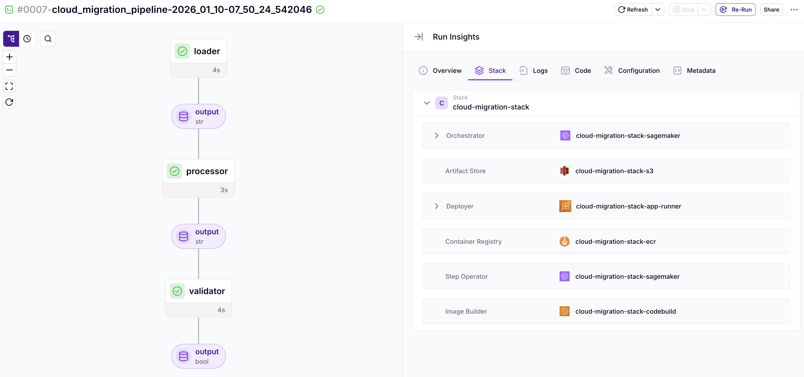

# ZenML Solutions Engineering Checklist

- [x] Forked the repo, installed dependencies, and ran and deployed the pipeline locally
- [x] Created Terraform scripts to deploy the ZenML stack on AWS with SageMaker as the orchestrator
- [x] Deployed the Terraform scripts to create the ZenML stack on AWS
- [x] Ran the pipeline on the remote stack


# Steps I followed to complete the challenge

- Create a AWS_PROFILE named `zenml` OR any name of your choice and set it as run script environment variable.:
    ```shell
    # Activate the profile
    # AWS_PROFILE=zenml
    aws configure sso --profile zenml
    # OR
    aws sso login --profile zenml
    ```

- First, I forked the repo, installed dependencies, and ran and deployed the pipeline locally.
    ```shell
    # add deps
    uv add zenml --extra local --extra server

    # login
    uv run zenml login --local

    # init
    uv run zenml init

    # run the pipeline
    uv run src/run.py

    # deploy the pipeline
    uv run zenml pipeline deploy src.run:cloud_migration_pipeline
    ```

- Created a ZenML Pro account
  - Created a `cloud-migration-demo` organization, a `cloud-migration-workspace` workspace, and a `cloud-migration-project` project inside the workspace.
  - Created an API key, and stored it locally in an `.env` file along with the ZenML server URL.
    ```shell
    export ZENML_SERVER_URL="https://cloud.zenml.io"
    export ZENML_API_KEY="your_api_key_here"
    ```

- Next, I filled the Terraform script to deploy the ZenML stack on AWS with SageMaker as the orchestrator.
  - And deployed the Terraform scripts to create the ZenML stack on AWS.
  - ref: [github-aws-zenml-stack](https://github.com/zenml-io/terraform-aws-zenml-stack), [zenml-stack-module-docs](https://registry.terraform.io/modules/zenml-io/zenml-stack/aws/latest)

- THen locally configured ZenML Pro as per the Onboarding guide:
    ```shell
    # local setup
    zenml login cloud-migration-workspace  && zenml init && zenml stack set cloud-migration-stack

    # set the project
    zenml project set cloud-migration-project

    # install integrations
    zenml integration install s3 aws --uv

    # I had to install few dependencies manually to get past some errors before running the pipeline
    uv add "sagemaker>=2.237.3,<3.0.0" kubernetes aws-profile-manager
    ```

    The deployed stack:
    ```shell
    ╭─amitraj@laptop ~/repos/zenml-solution-engineering-challenge ‹feat/solution●› ‹.venv› 
    ╰─$ zenml stack describe
                    Stack Configuration                   
    ╭────────────────────┬──────────────────────────────────╮
    │ COMPONENT_TYPE     │ COMPONENT_NAME                   │
    ├────────────────────┼──────────────────────────────────┤
    │ ARTIFACT_STORE     │ cloud-migration-stack-s3         │
    ├────────────────────┼──────────────────────────────────┤
    │ STEP_OPERATOR      │ cloud-migration-stack-sagemaker  │
    ├────────────────────┼──────────────────────────────────┤
    │ IMAGE_BUILDER      │ cloud-migration-stack-codebuild  │
    ├────────────────────┼──────────────────────────────────┤
    │ ORCHESTRATOR       │ cloud-migration-stack-sagemaker  │
    ├────────────────────┼──────────────────────────────────┤
    │ CONTAINER_REGISTRY │ cloud-migration-stack-ecr        │
    ├────────────────────┼──────────────────────────────────┤
    │ DEPLOYER           │ cloud-migration-stack-app-runner │
    ╰────────────────────┴──────────────────────────────────╯
            'cloud-migration-stack' stack (ACTIVE)          
                Labels             
    ╭──────────────────┬───────────╮
    │ LABEL            │ VALUE     │
    ├──────────────────┼───────────┤
    │ zenml:deployment │ terraform │
    ├──────────────────┼───────────┤
    │ zenml:provider   │ aws       │
    ╰──────────────────┴───────────╯
    Stack 'cloud-migration-stack' with id '...' is owned by user <my-email>@gmail.com.
    Dashboard URL: https://cloud.zenml.io/workspaces/cloud-migration-workspace/stacks?id=...
    ```

- While trying to run the pipeline with the SageMaker orchestrator, I got the following errors.

    <p align="center">
        
        <br>
        <em>Pipeline Run on Deployed Stack</em>
    </p>


  - Although the pipeline ran successfully later on after running the setting the orchestrator to asynchronous mode.
  - A RuntimeError Error:
    ```shell
    RuntimeError: Timed out while waiting for pipeline execution to finish. For long-running pipelines we recommend configuring your 
    orchestrator for asynchronous execution. The following command does this for you: 
    `zenml orchestrator update cloud-migration-stack-sagemaker --synchronous=False`
    ```

    <details>
        <summary>RuntimeError Error:</summary>

    ```shell
    To opt out of telemetry, please disable via TelemetryOptOut parameter in SDK defaults config. For more information, refer to https://sagemaker.readthedocs.io/en/stable/overview.html#configuring-and-using-defaults-with-the-sagemaker-python-sdk.
    Steps can take 5-15 minutes to start running when using the Sagemaker Orchestrator.
    There was an issue while extracting the SageMaker Studio URL: An error occurred (AccessDeniedException) when calling the ListDomains operation: User: arn:aws:sts::643766342908:assumed-role/zenml-39163c977f9b/zenml-connector-df5648e5-6c93-4661-a09c-5002a551c756 is not authorized to perform: sagemaker:ListDomains on resource: arn:aws:sagemaker:us-west-2:643766342908:domain/* because no identity-based policy allows the sagemaker:ListDomains action
    Executing synchronously. Waiting for pipeline to finish... 
    At this point you can Ctrl-C out without cancelling the execution.
    ╭─────────────────────────────── Traceback (most recent call last) ────────────────────────────────╮
    │ /Users/amitraj/repos/zenml-solution-engineering-challenge/src/run.py:49 in <module>              │
    │                                                                                                  │
    │   46 │   # - Make sure you are logged in to a remote ZenML server (not `zenml login --local`)    │
    │   47 │   # - Make sure your Terraform-provisioned stack is set before running:                   │
    │   48 │   #   `zenml stack set <your-stack-name-or-id>`                                           │
    │ ❱ 49 │   cloud_migration_pipeline()                                                              │
    │   50                                                                                             │
    │                                                                                                  │
    │ /Users/amitraj/repos/zenml-solution-engineering-challenge/.venv/lib/python3.12/site-packages/zen │
    │ ml/pipelines/pipeline_definition.py:1598 in __call__                                             │
    │                                                                                                  │
    │   1595 │   │   │   return self.entrypoint(*args, **kwargs)  # type: ignore[no-any-return]        │
    │   1596 │   │                                                                                     │
    │   1597 │   │   self.prepare(*args, **kwargs)                                                     │
    │ ❱ 1598 │   │   return self._run()                                                                │
    │   1599 │                                                                                         │
    │   1600 │   def _call_entrypoint(self, *args: Any, **kwargs: Any) -> Any:                         │
    │   1601 │   │   """Calls the pipeline entrypoint function with the given arguments.               │
    │                                                                                                  │
    │ /Users/amitraj/repos/zenml-solution-engineering-challenge/.venv/lib/python3.12/site-packages/zen │
    │ ml/pipelines/pipeline_definition.py:1071 in _run                                                 │
    │                                                                                                  │
    │   1068 │   │   │   │   │   │   │   "`zenml login --local`."                                      │
    │   1069 │   │   │   │   │   │   )                                                                 │
    │   1070 │   │   │   │                                                                             │
    │ ❱ 1071 │   │   │   │   submit_pipeline(                                                          │
    │   1072 │   │   │   │   │   snapshot=snapshot, stack=stack, placeholder_run=run                   │
    │   1073 │   │   │   │   )                                                                         │
    │   1074                                                                                           │
    │                                                                                                  │
    │ /Users/amitraj/repos/zenml-solution-engineering-challenge/.venv/lib/python3.12/site-packages/zen │
    │ ml/execution/pipeline/utils.py:103 in submit_pipeline                                            │
    │                                                                                                  │
    │   100 │   │   except RunMonitoringError as e:                                                    │
    │   101 │   │   │   # Don't mark the run as failed if the error happened during                    │
    │   102 │   │   │   # monitoring of the run.                                                       │
    │ ❱ 103 │   │   │   raise e.original_exception from None                                           │
    │   104 │   │   except BaseException as e:                                                         │
    │   105 │   │   │   if (                                                                           │
    │   106 │   │   │   │   placeholder_run                                                            │
    │                                                                                                  │
    │ /Users/amitraj/repos/zenml-solution-engineering-challenge/.venv/lib/python3.12/site-packages/zen │
    │ ml/orchestrators/base_orchestrator.py:416 in run                                                 │
    │                                                                                                  │
    │   413 │   │   │   │   │                                                                          │
    │   414 │   │   │   │   │   if submission_result.wait_for_completion:                              │
    │   415 │   │   │   │   │   │   try:                                                               │
    │ ❱ 416 │   │   │   │   │   │   │   submission_result.wait_for_completion()                        │
    │   417 │   │   │   │   │   │   except KeyboardInterrupt as e:                                     │
    │   418 │   │   │   │   │   │   │   message = (                                                    │
    │   419 │   │   │   │   │   │   │   │   "Run monitoring interrupted, but "                         │
    │                                                                                                  │
    │ /Users/amitraj/repos/zenml-solution-engineering-challenge/.venv/lib/python3.12/site-packages/zen │
    │ ml/integrations/aws/orchestrators/sagemaker_orchestrator.py:926 in _wait_for_completion          │
    │                                                                                                  │
    │    923 │   │   │   │   │   │   )                                                                 │
    │    924 │   │   │   │   │   │   logger.info("Pipeline completed successfully.")                   │
    │    925 │   │   │   │   │   except WaiterError:                                                   │
    │ ❱  926 │   │   │   │   │   │   raise RuntimeError(                                               │
    │    927 │   │   │   │   │   │   │   "Timed out while waiting for pipeline execution to "          │
    │    928 │   │   │   │   │   │   │   "finish. For long-running pipelines we recommend "            │
    │    929 │   │   │   │   │   │   │   "configuring your orchestrator for asynchronous "             │
    ╰──────────────────────────────────────────────────────────────────────────────────────────────────╯
    RuntimeError: Timed out while waiting for pipeline execution to finish. For long-running pipelines we recommend configuring your 
    orchestrator for asynchronous execution. The following command does this for you: 
    `zenml orchestrator update cloud-migration-stack-sagemaker --synchronous=False`
    ```
    </details>

  - AssertionError from `aiobotocore`:
    ```shell
    AssertionError: Session was never entered
    ```

    <details>
        <summary>AssertionError from aiobotocore: Session was never entered</summary>

    ```shell
    ╭─amitraj@laptop ~/repos/zenml-solution-engineering-challenge ‹feat/solution●› ‹zenml-solution-engineering-challenge› 
    ╰─$ ./run run_pipeline         
    Initiating a new run for the pipeline: cloud_migration_pipeline.
    sagemaker.config INFO - Not applying SDK defaults from location: /Library/Application Support/sagemaker/config.yaml
    sagemaker.config INFO - Not applying SDK defaults from location: /Users/amitraj/Library/Application Support/sagemaker/config.yaml
    Reusing existing build d21fbd57-2a3f-4d74-a74c-652d1bb99a01 for stack cloud-migration-stack.
    Archiving pipeline code directory: /Users/amitraj/repos/zenml-solution-engineering-challenge. If this is taking longer than you expected, make sure your source root is set correctly by running zenml init, and that it does not contain unnecessarily huge files.
    Code already exists in artifact store, skipping upload.
    Using a build:
    Image(s): 643766342908.dkr.ecr.us-west-2.amazonaws.com/zenml-39163c977f9b:977ae1de-a848-441c-8dea-6ec34bcb8ec7, 643766342908.dkr.ecr.us-west-2.amazonaws.com/zenml-39163c977f9b:44aa40e9-132f-4ef5-8548-bd76f9ea6da0
    Using user: avr13405@gmail.com
    Using stack: cloud-migration-stack
    artifact_store: cloud-migration-stack-s3
    step_operator: cloud-migration-stack-sagemaker
    image_builder: cloud-migration-stack-codebuild
    orchestrator: cloud-migration-stack-sagemaker
    container_registry: cloud-migration-stack-ecr
    deployer: cloud-migration-stack-app-runner
    Dashboard URL for Pipeline Run: https://cloud.zenml.io/workspaces/cloud-migration-workspace/projects/9e096638-3faa-43bf-a859-6533210fdff2/runs/519b24fe-ddc8-4cfe-a905-59beb9767488
    SageMaker Python SDK will collect telemetry to help us better understand our user's needs, diagnose issues, and deliver additional features.
    To opt out of telemetry, please disable via TelemetryOptOut parameter in SDK defaults config. For more information, refer to https://sagemaker.readthedocs.io/en/stable/overview.html#configuring-and-using-defaults-with-the-sagemaker-python-sdk.
    Popping out 'TrainingJobName' from the pipeline definition by default since it will be overridden at pipeline execution time. Please utilize the PipelineDefinitionConfig to persist this field in the pipeline definition if desired.
    Popping out 'TrainingJobName' from the pipeline definition by default since it will be overridden at pipeline execution time. Please utilize the PipelineDefinitionConfig to persist this field in the pipeline definition if desired.
    Popping out 'TrainingJobName' from the pipeline definition by default since it will be overridden at pipeline execution time. Please utilize the PipelineDefinitionConfig to persist this field in the pipeline definition if desired.
    SageMaker Python SDK will collect telemetry to help us better understand our user's needs, diagnose issues, and deliver additional features.
    To opt out of telemetry, please disable via TelemetryOptOut parameter in SDK defaults config. For more information, refer to https://sagemaker.readthedocs.io/en/stable/overview.html#configuring-and-using-defaults-with-the-sagemaker-python-sdk.
    Steps can take 5-15 minutes to start running when using the Sagemaker Orchestrator.
    There was an issue while extracting the SageMaker Studio URL: An error occurred (AccessDeniedException) when calling the ListDomains operation: User: arn:aws:sts::643766342908:assumed-role/zenml-39163c977f9b/zenml-connector-df5648e5-6c93-4661-a09c-5002a551c756 is not authorized to perform: sagemaker:ListDomains on resource: arn:aws:sagemaker:us-west-2:643766342908:domain/* because no identity-based policy allows the sagemaker:ListDomains action
    Task exception was never retrieved
    future: <Task finished name='Task-28' coro=<ClientCreatorContext.__aexit__() done, defined at /Users/amitraj/repos/zenml-solution-engineering-challenge/.venv/lib/python3.12/site-packages/aiobotocore/session.py:35> exception=AssertionError('Session was never entered')>
    Traceback (most recent call last):
    File "/Users/amitraj/repos/zenml-solution-engineering-challenge/.venv/lib/python3.12/site-packages/aiobotocore/session.py", line 36, in __aexit__
        await self._client.__aexit__(exc_type, exc_val, exc_tb)
    File "/Users/amitraj/repos/zenml-solution-engineering-challenge/.venv/lib/python3.12/site-packages/aiobotocore/client.py", line 644, in __aexit__
        await self._endpoint.http_session.__aexit__(exc_type, exc_val, exc_tb)
    File "/Users/amitraj/repos/zenml-solution-engineering-challenge/.venv/lib/python3.12/site-packages/aiobotocore/httpsession.py", line 111, in __aexit__
        assert self._sessions is not None, 'Session was never entered'
            ^^^^^^^^^^^^^^^^^^^^^^^^^^
    AssertionError: Session was never entered
    Task completed in 0m46.408s
    ```
    </details>

  - During the pipeline run, I also got this Sagemaker Permission Error. Since this was non-blocking, I didn't do anything about it.
      ```shell
      There was an issue while extracting the SageMaker Studio URL: An error occurred (AccessDeniedException) when calling the ListDomains operation: User: arn:aws:sts::643766342908:assumed-role/zenml-39163c977f9b/zenml-connector-df5648e5-6c93-4661-a09c-5002a551c756 is not authorized to perform: sagemaker:ListDomains on resource: arn:aws:sagemaker:us-west-2:643766342908:domain/* because no identity-based policy allows the sagemaker:ListDomains action
      ```

